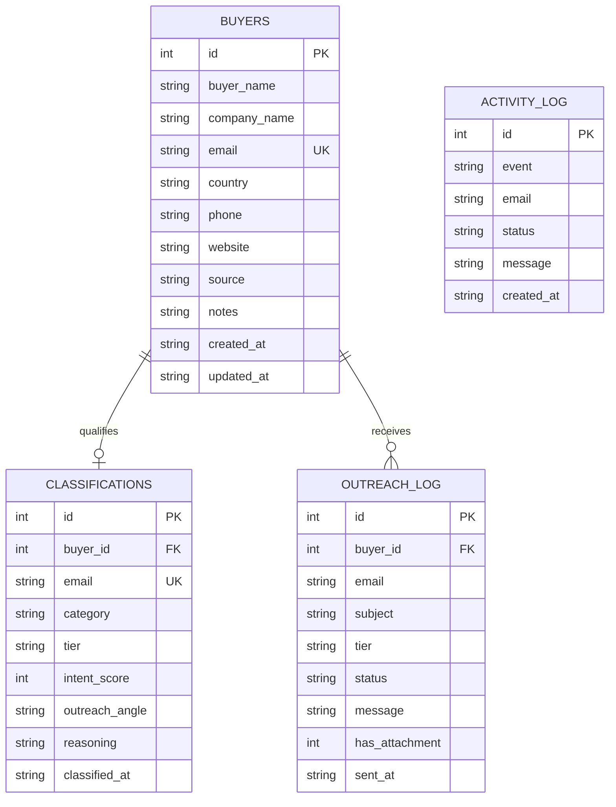

# EXPORT Automation System — Enterprise B2B Lead Platform

[](https://www.python.org/)
[](https://www.sqlite.org/)
[](https://aistudio.google.com/)
[](https://mail.google.com/)
[](#-automated-testing-suite)
[](LICENSE)

An enterprise-grade, portfolio-ready Python automation system engineered for an international export manufacturer of **Himalayan Singing Bowls** (hand-hammered 7-metal bronze alloys, 7-chakra tuned sets, meditation gongs, felt mallets, and hand-embroidered brocade cushions).

The system automates the entire B2B international sales funnel:
**Multi-Source Discovery → Data Normalization → Quality Hygiene & Validation → Multi-Layer Deduplication → AI Lead Qualification & Tiering → Relational Persistence (SQLite + CSV) → Rate-Limited MIME Outreach with PDF Catalog Attachment → Audit Logging → Interactive Real-Time Web Dashboard.**

---

## 📌 Table of Contents

- [System Architecture](#-system-architecture)
- [Key Features Across Phases](#-key-features-across-phases)
- [Project Directory Structure](#-project-directory-structure)
- [Quickstart & Installation](#-quickstart--installation)
- [Environment Configuration](#-environment-configuration)
- [Running the System](#-running-the-system)
  - [Command Line Pipeline](#1-command-line-pipeline)
  - [Interactive Web Dashboard](#2-interactive-web-dashboard)
- [Database Architecture & Schema](#-database-architecture--schema)
- [Dashboard REST API Reference](#-dashboard-rest-api-reference)
- [Automated Testing Suite](#-automated-testing-suite)
- [Engineering Highlights & Interview Talking Points](#-engineering-highlights--interview-talking-points)

---

## 🏛️ System Architecture

```text
 ┌─────────────────────────────────────────────────────────────────────────────┐
 │                            1. LEAD DISCOVERY                                │
 │  ┌──────────────────────┐ ┌──────────────────────┐ ┌──────────────────────┐ │
 │  │ Google Search Engine │ │ B2B Trade Directory  │ │ Website Web Crawler  │ │
 │  └──────────┬───────────┘ └──────────┬───────────┘ └──────────┬───────────┘ │
 └─────────────┼────────────────────────┼────────────────────────┼─────────────┘
               └──────────────────────┐ │ ┌──────────────────────┘
                                      ▼ ▼ ▼
 ┌─────────────────────────────────────────────────────────────────────────────┐
 │                      2. DATA QUALITY & SANITIZATION                         │
 │   - Strip whitespaces & lowercase emails                                    │
 │   - Check for missing fields (Company, Website, Country, Name)              │
 │   - Filter dummy/placeholder emails (e.g., test@test.com, none@domain.com)  │
 │   - RFC-compliant email regex validation                                    │
 │   - Statuses: VALID, INCOMPLETE, INVALID_EMAIL, DUPLICATE, REJECTED         │
 └──────────────────────────────────────┬──────────────────────────────────────┘
                                        ▼
 ┌─────────────────────────────────────────────────────────────────────────────┐
 │                       3. MULTI-LAYER DEDUPLICATION                          │
 │   - Email uniqueness check (buyers table & buyers.csv)                      │
 │   - Fuzzy Company + Domain composite key check                              │
 │   - Prior outreach delivery history check (sent_log table & sent_log.csv)   │
 └──────────────────────────────────────┬──────────────────────────────────────┘
                                        ▼
 ┌─────────────────────────────────────────────────────────────────────────────┐
 │                 4. AI LEAD CLASSIFICATION & TIERING                         │
 │   - Google Gemini 1.5 Flash API (with explainable heuristic fallback)       │
 │   - Business vs Individual categorization                                   │
 │   - Commercial Priority Tiering:                                            │
 │     • Tier 1: Wholesale Importers & Bulk Distributors (Intent Score 90-100) │
 │     • Tier 2: Sound Healing Studios, Spas & Academies (Intent Score 70-89)  │
 │     • Tier 3: Independent Yoga Instructors & Retail (Intent Score 30-69)    │
 │     • Irrelevant: Non-commercial / spam inquiries                           │
 │   - Automated Commercial Pitch Angle Synthesis                              │
 └──────────────────────────────────────┬──────────────────────────────────────┘
                                        ▼
 ┌─────────────────────────────────────────────────────────────────────────────┐
 │               5. RELATIONAL DUAL-PERSISTENCE ARCHITECTURE                   │
 │   ┌───────────────────────────────────┐ ┌─────────────────────────────────┐ │
 │   │ Enterprise SQLite Database        │ │ Flat CSV Data Lake              │ │
 │   │ (data/export_automation.db)       │ │ (data/*.csv)                    │ │
 │   │ • buyers (Master Catalog)         │ │ • buyers.csv                    │ │
 │   │ • classifications (AI Tiers)      │ │ • business_buyers.csv (B2B)     │ │
 │   │ • outreach_log (Sent History)     │ │ • individual_buyers.csv (B2C)   │ │
 │   │ • activity_log (Audit Trail)      │ │ • sent_log.csv & activity_log   │ │
 │   └───────────────────────────────────┘ └─────────────────────────────────┘ │
 └──────────────────────────────────────┬──────────────────────────────────────┘
                                        ▼
 ┌─────────────────────────────────────────────────────────────────────────────┐
 │                   6. OUTREACH & EMAIL AUTOMATION ENGINE                     │
 │   - Multipart MIME message composition (Plain Text + Rich HTML)             │
 │   - Dynamic personalization placeholders ({buyer_name}, {pitch_angle}, etc) │
 │   - Official B2B Product Catalog PDF attached (company_presentation.pdf)    │
 │   - Rolling daily sending quota enforcement (max 100/day default)           │
 │   - Safe dry-run simulation mode (zero cost & zero spam risk in test mode)  │
 └──────────────────────────────────────┬──────────────────────────────────────┘
                                        ▼
 ┌─────────────────────────────────────────────────────────────────────────────┐
 │                 7. INTERACTIVE WEB DASHBOARD & REST API                     │
 │   - Real-time SQLite KPI metric cards & interactive charts                  │
 │   - On-demand pipeline execution trigger                                    │
 │   - Interactive Email Validator & AI Classifier playgrounds                 │
 │   - Manual lead intake form with immediate normalization & deduplication    │
 │   - Searchable, filterable tabular data views with one-click CSV/DB exports │
 └─────────────────────────────────────────────────────────────────────────────┘
```

---

## ⚡ Key Features Across Phases

### Phase 1: Foundation & Data Infrastructure
- **Safe Environment Loader**: Centralized configuration via `config.py` with automatic `.env` discovery.
- **Data Normalization Engine**: Trims whitespace, standardizes casing, validates URL schemes, and formats phone numbers.
- **Email Syntax Validation**: Strict regex conforming to RFC 5322 without making intrusive SMTP network calls.
- **Two-Tier Deduplication**: Prevents duplicate catalog insertions and blocks re-contacting previously reached leads.
- **Audit Logging**: Comprehensive activity tracking recorded with ISO 8601 timestamps in `activity_log.csv`.

### Phase 2: Multi-Source Lead Discovery & Data Quality
- **Modular Search Adapters (`search/`)**:
  - `GoogleSearchAdapter`: Targeted search queries for wholesale importers, wellness distributors, and sound studios.
  - `DirectorySearchAdapter`: HTML directory scraper targeting trade association listings and wholesale hubs.
  - `WebsiteSearchAdapter`: Deep crawler parsing contact pages (`/contact`, `/about`) with regex email/phone extraction.
  - `MockLeadAdapter`: Built-in offline dataset for 100% reproducible tests and offline demos.
- **Data Quality Assessment Engine (`validation/data_quality.py`)**:
  - Evaluates every lead against 5 discrete statuses: `VALID`, `INCOMPLETE`, `INVALID_EMAIL`, `DUPLICATE`, `REJECTED`.
  - Rejects dummy/placeholder emails (`test@test.com`, `admin@example.com`, `none@domain.com`).

### Phase 3: AI Lead Qualification & Priority Tiering
- **Google Gemini Integration**: Uses Google Gemini (`gemini-1.5-flash`) via `google-genai` SDK for automated buyer intent scoring.
- **Explainable Rule-Based Heuristic Engine**: Zero-dependency offline fallback inspecting corporate entity suffixes (`GmbH`, `Ltd`, `Wholesale`, `Imports`), registered web domains, and freemail providers.
- **Four-Tier Priority Matrix**:
  - **Tier 1 (High Priority Bulk)**: Wholesale distributors, import-export houses, sound healing academies (Intent Score: 90–100).
  - **Tier 2 (Medium Priority)**: Sound therapy studios, meditation centers, luxury spas, yoga studios (Intent Score: 70–89).
  - **Tier 3 (Low Priority Solo)**: Independent practitioners, solo meditation instructors (Intent Score: 30–69).
  - **Irrelevant**: General inquiries, non-commercial entities, broken profiles.
- **Dynamic Outreach Angle Synthesis**: Generates customized commercial propositions (e.g., direct factory wholesale rates vs. master-grade chakra-tuned therapy sets).

### Phase 4: Automated Outreach & Email Automation
- **MIME Email Composition (`outreach/email_sender.py`)**: Generates multipart MIME emails with both text fallback and styled HTML templates.
- **Dynamic Template Personalizer (`outreach/template_manager.py`)**: Replaces dynamic variables: `{buyer_name}`, `{company_name}`, `{country}`, `{pitch_angle}`, `{sender_name}`, `{sender_company}`, `{sender_contact}`.
- **PDF Catalog Presentation Attachment**: Automatically attaches the official B2B company presentation catalog (`assets/company_presentation.pdf`).
- **Safety & Rate Limiting (`outreach/rate_limiter.py`)**:
  - Daily sending quota enforcement (`DAILY_SEND_LIMIT`, default: 100 emails/day).
  - Prevents mailbox blacklisting and preserves domain reputation.
  - Safe dry-run mode enabled by default (`TEST_MODE=True` or `DRY_RUN=True`).

### Phase 5: Enterprise SQLite Database & Dual-Persistence
- **Relational SQLite Engine (`database/`)**:
  - `connection.py`: Thread-safe SQLite connection factory with foreign key enforcement and row factory.
  - `schema.py`: Enterprise schema with 4 normalized tables (`buyers`, `classifications`, `outreach_log`, `activity_log`), indexed lookups, and auto-timestamps.
  - `repository.py`: Clean Repository Pattern with CRUD operations and SQL aggregation queries.
  - `migration.py`: Automated zero-loss migration tool synchronizing legacy flat CSV records into SQLite.
- **Dual-Persistence Synchronization**: Every cataloged lead, classification, and outreach event writes simultaneously to both SQLite and CSV mirrors.

### Phase 6: Interactive Web Dashboard & UI
- **Zero-Dependency Native Python Server**: Built on Python's native `http.server.ThreadingHTTPServer` (no bulky node or flask requirements).
- **Executive KPI Cards**: Real-time counters for Total Buyers, Tier 1 Wholesalers, Tier 2 Studios, Tier 3 Solo, Outreach Sent, and Daily Limits.
- **Interactive Playgrounds**:
  - **Email Validator Playground**: Test email syntax and duplicate status in real time.
  - **AI Classification Playground**: Test company names and notes to see instant Category, Tier, Intent Score, and Outreach Angle.
  - **Manual Lead Intake Modal**: Add individual buyer records with instant normalization, validation, and dual persistence.
  - **One-Click Pipeline Trigger**: Run end-to-end discovery and classification directly from the browser.
  - **Demo Reset Engine**: Reset data to a clean state for pristine video recordings and portfolio presentations.

### Phase 7: Production Polish & Deployment Readiness
- **Comprehensive CLI Interface**: Flexible command-line flags in both `main.py` and `dashboard.py` via `argparse`.
- **Complete Dependency Management**: Locked `requirements.txt` containing all necessary packages.
- **Configuration Integrity**: Standardized `.env.example` documenting all configuration options.
- **Complete Test Coverage**: 76 unit tests across 7 test suites with 100% pass rate.

---

## 📁 Project Directory Structure

```text
export-automation/
│
├── main.py                     # CLI pipeline entrypoint (supports --test, --live, --dry-run, etc.)
├── dashboard.py                # Web dashboard server (supports --port, --host)
├── config.py                   # Centralized configuration, paths, and environment loader
├── requirements.txt            # Python dependencies (google-genai, reportlab, requests, etc.)
├── .env.example                # Documented environment variable template
├── .gitignore                  # Git ignore rules for virtualenvs, bytecode, and temp files
├── README.md                   # Comprehensive documentation and portfolio showcase
│
├── search/                     # [Phase 2] Modular lead discovery adapters
│   ├── __init__.py             # Unified discovery orchestrator (discover_all_leads)
│   ├── google_search.py        # Google Custom Search API adapter & fallback
│   ├── directory_search.py     # B2B Trade directory parser
│   └── website_search.py       # Website contact page crawler & scraper
│
├── validation/                 # [Phase 1 & 2] Lead validation and data quality
│   ├── __init__.py
│   ├── email_validator.py      # Email syntax checking & placeholder detection
│   └── data_quality.py         # 5-tier quality assessment engine & statistics tracker
│
├── classification/             # [Phase 3] AI lead classification & tiering
│   ├── __init__.py
│   └── classifier.py           # Gemini AI classifier with intelligent heuristic fallback
│
├── outreach/                   # [Phase 4] Automated email outreach & delivery
│   ├── __init__.py
│   ├── email_sender.py         # SMTP sender, MIME generator, and catalog PDF attacher
│   ├── template_manager.py     # HTML & text email personalizer with dynamic placeholders
│   └── rate_limiter.py         # Daily email quota tracker & duplicate check
│
├── database/                   # [Phase 5] Enterprise SQLite database layer
│   ├── __init__.py             # Unified database facade
│   ├── connection.py           # Thread-safe SQLite connection factory & row factory
│   ├── schema.py               # DDL schemas with indexes and foreign keys
│   ├── repository.py           # Data access repository (CRUD, aggregations, stats)
│   └── migration.py            # Automated CSV-to-SQLite synchronization tool
│
├── extraction/                 # Data normalization & CSV persistence
│   ├── __init__.py
│   └── data_extractor.py       # Normalizes leads and manages dual-write CSV mirrors
│
├── logging_module/             # Activity auditing and event logging
│   ├── __init__.py
│   └── activity_logger.py      # Structured audit trail logger (activity_log & sent_log)
│
├── templates/                  # Frontend UI templates
│   └── dashboard.html          # Responsive modern executive dashboard UI
│
├── assets/                     # Commercial collateral & attachments
│   └── company_presentation.pdf# Handcrafted Himalayan Singing Bowls B2B Export Catalog
│
├── data/                       # Persistent database & data lake
│   ├── export_automation.db    # Enterprise SQLite database
│   ├── buyers.csv              # Master catalog of all unique, validated buyers
│   ├── business_buyers.csv     # Filtered B2B export targets (Tier 1 & Tier 2)
│   ├── individual_buyers.csv   # Filtered B2C consumers & solo buyers (Tier 3)
│   ├── sent_log.csv            # Outreach transmission history
│   └── activity_log.csv        # Complete chronological audit trail
│
└── tests/                      # Automated unit testing suite (76 tests)
    ├── __init__.py
    ├── test_phase1.py          # Phase 1: Foundation, extraction, and validation (6 tests)
    ├── test_phase2.py          # Phase 2: Lead discovery & data quality (17 tests)
    ├── test_phase3.py          # Phase 3: AI lead classification & tiering (16 tests)
    ├── test_phase4.py          # Phase 4: Outreach & email automation (12 tests)
    ├── test_phase5.py          # Phase 5: SQLite database & migration (8 tests)
    ├── test_phase6.py          # Phase 6: Web dashboard & API endpoints (6 tests)
    └── test_phase7.py          # Phase 7: CLI parsing & deployment polish (11 tests)
```

---

## 🛠️ Quickstart & Installation

### 1. Prerequisites
- **Python 3.10+** installed on your system.
- Git installed.

### 2. Clone Repository & Setup Virtual Environment
```bash
# Clone the repository
git clone https://github.com/Entangled-mind/export-automation.git
cd export-automation

# Create a virtual environment
python -m venv venv

# Activate the virtual environment
# Windows (PowerShell):
.\venv\Scripts\Activate.ps1
# Windows (Command Prompt):
.\venv\Scripts\activate.bat
# Linux / macOS:
source venv/bin/activate
```

### 3. Install Dependencies
```bash
pip install -r requirements.txt
```

---

## ⚙️ Environment Configuration

Copy the `.env.example` template to `.env`:
```bash
# Windows
copy .env.example .env

# Linux / macOS
cp .env.example .env
```

### Available Configuration Parameters

| Variable | Default Value | Description |
|:---|:---|:---|
| `TEST_MODE` | `True` | Runs in offline simulation mode with mock search adapters and zero network costs. |
| `DRY_RUN` | `True` | Generates full MIME emails and attaches PDF without sending live SMTP packets. |
| `SEARCH_KEYWORD` | `Singing Bowls wholesale imports studio` | Search keyword used by discovery adapters. |
| `GEMINI_API_KEY` | *(empty)* | Optional. Google Gemini API Key. If omitted, heuristic fallback is used. |
| `GEMINI_MODEL` | `gemini-1.5-flash` | Gemini model for AI qualification. |
| `GMAIL_EMAIL` | *(empty)* | Google email account used for SMTP authentication. |
| `GMAIL_APP_PASSWORD` | *(empty)* | 16-character Google App Password (not your normal password). |
| `SMTP_HOST` | `smtp.gmail.com` | SMTP relay server. |
| `SMTP_PORT` | `465` | SMTP port (`465` for SSL, `587` for STARTTLS). |
| `USE_SSL` | `True` | Direct SSL connection (`True` for 465). |
| `DAILY_SEND_LIMIT` | `100` | Max outreach emails dispatched per rolling 24-hour cycle. |
| `PRESENTATION_PATH`| `assets/company_presentation.pdf` | Path to the PDF export catalog attachment. |
| `SENDER_NAME` | `Himalayan Export & Artisan Guild` | Commercial agent name in email sign-off. |
| `SENDER_COMPANY` | `Himalayan Artisan Singing Bowls Ltd.` | Manufacturer company name. |
| `SENDER_CONTACT` | `+977-1-4412345 \| export@...` | Commercial inquiry contact info. |

---

## 🚀 Running the System

### 1. Command Line Pipeline

Execute the end-to-end pipeline with standard default settings:
```bash
python main.py
```

#### CLI Options & Flags
```text
usage: main.py [-h] [--test | --live] [--dry-run | --live-send]
               [--query QUERY] [--limit LIMIT] [--no-discovery]
               [--no-outreach] [--tier TIER]

options:
  -h, --help            Show this help message and exit
  --test                Force TEST_MODE (uses mock search adapters & offline test fallbacks)
  --live                Run in LIVE mode (queries live search engines & Gemini AI)
  --dry-run             Simulate email outreach without sending live SMTP messages
  --live-send           Enable live SMTP email dispatch (requires SMTP credentials)
  --query, -q QUERY     Target search query (e.g. "Tibetan Singing Bowls wholesale distributor")
  --limit, -n LIMIT     Maximum leads to fetch per discovery adapter (default: 15)
  --no-discovery        Skip web discovery and process existing leads in the database
  --no-outreach         Skip the email outreach campaign dispatch step
  --tier TIER           Comma-separated target tiers for outreach (default: '1,2')
```

#### Example Commands
```bash
# Run in safe test mode with dry-run outreach
python main.py --test --dry-run

# Run discovery with a custom product query and limit of 25 leads
python main.py --query "Singing Bowl sound therapy spa wholesale" --limit 25

# Process existing leads in the database without making new search calls
python main.py --no-discovery

# Run lead discovery and AI classification only (skip email outreach)
python main.py --no-outreach

# Target only Tier 1 bulk wholesale buyers for outreach
python main.py --tier 1
```

---

### 2. Interactive Web Dashboard

Launch the local web dashboard server:
```bash
python dashboard.py
```

Then open your browser and navigate to:
**`http://localhost:5000`**

#### Dashboard CLI Flags
```bash
# Launch on custom port
python dashboard.py --port 8080

# Bind to all interfaces (for remote/container deployment)
python dashboard.py --host 0.0.0.0 --port 5000
```

#### Dashboard Capabilities
1. **Executive Metric Cards**: Live counters for total cataloged leads, Tier 1 Wholesalers, Tier 2 Studios, Tier 3 Solo buyers, and today's sent quota.
2. **One-Click Pipeline Trigger**: Click **"Run Full Pipeline"** to trigger discovery, classification, and outreach directly from the UI.
3. **Email Validator Playground**: Enter an email address to test regex syntax, domain format, and duplicate presence in real time.
4. **AI Lead Classifier Playground**: Input any company name and description to see instant Category, Priority Tier, Intent Score, and synthesized Outreach Angle.
5. **Add Buyer Modal**: Onboard new leads manually with automatic normalization, validation, and dual-persistence.
6. **Simulate Outreach**: Send a batch of simulated emails to verify templates and PDF attachments.
7. **Searchable Data Tables**: Inspect all buyers, B2B wholesale leads, B2C solo leads, sent history, and detailed audit logs.
8. **One-Click Exports**: Download `buyers.csv`, `business_buyers.csv`, `sent_log.csv`, or the raw SQLite database with one click.
9. **Clean Demo Reset**: Reset and re-seed the environment for clean portfolio demonstrations.

---

## 🗄️ Database Architecture & Schema

The system uses an enterprise SQLite database (`data/export_automation.db`) backed by a clean Repository Pattern. Foreign key constraints and indices are enabled.



### Table Definitions
1. **`buyers`**: Master catalog of unique international buyer contacts. Unique index on `email`.
2. **`classifications`**: AI qualification results with foreign key cascade to `buyers(id)`. Unique index on `email`.
3. **`outreach_log`**: Detailed outreach delivery history with indexes on `email` and `sent_at`.
4. **`activity_log`**: Chronological audit trail of all pipeline lifecycle events.

---

## 🔌 Dashboard REST API Reference

The dashboard provides a lightweight, zero-dependency REST API:

| Method | Endpoint | Description |
|:---|:---|:---|
| `GET` | `/api/data` | Returns comprehensive database metrics, recent buyers, classifications, outreach history, and activity logs. |
| `POST` | `/api/run-pipeline` | Executes the complete end-to-end pipeline and returns execution statistics. |
| `POST` | `/api/test-email` | Tests an email string for RFC syntax validity, dummy flags, and database duplicate status. |
| `POST` | `/api/test-classify` | Runs AI classification on supplied lead metadata (Company, Name, Notes, Website). |
| `POST` | `/api/add-buyer` | Normalizes, validates, and adds a new lead to SQLite and CSV simultaneously. |
| `POST` | `/api/simulate-outreach`| Dispatches simulated outreach dispatches to top qualified B2B leads. |
| `POST` | `/api/reset-data` | Resets database and CSVs to clean demo baseline dataset. |
| `GET` | `/api/export/<filename>`| Downloads flat files (`buyers.csv`, `business_buyers.csv`, `sent_log.csv`, `db`). |

---

## 🧪 Automated Testing Suite

The project includes **76 comprehensive unit tests** across 7 test suites, providing full regression coverage.

```bash
# Run all 76 unit tests
python -m unittest discover -s tests -p "test_*.py" -v
```

### Test Suite Breakdown

| Test Suite | Focus Area | Test Count |
|:---|:---|:---:|
| `tests/test_phase1.py` | Data normalization, RFC email validation, CSV persistence & deduplication | 6 |
| `tests/test_phase2.py` | Google/Directory/Web search adapters, data quality engine (VALID, REJECTED, etc.) | 17 |
| `tests/test_phase3.py` | Gemini AI classifier, heuristic fallback, priority tiers (Tiers 1-3), intent scoring | 16 |
| `tests/test_phase4.py` | Multipart MIME builder, dynamic templates, PDF attachment, daily quota enforcement | 12 |
| `tests/test_phase5.py` | SQLite schema, connection pooling, repository CRUD, automated CSV migration | 8 |
| `tests/test_phase6.py` | Web dashboard HTTP server, REST API endpoints, reset engine, export routes | 6 |
| `tests/test_phase7.py` | CLI argument parsing, requirements completeness, environment template integrity | 11 |
| **Total** | **End-to-End Enterprise Test Coverage** | **76 Passed** |

> **Sandboxing Architecture**: All unit tests run inside isolated temporary directories (`tempfile.mkdtemp`). Tests never pollute or overwrite your production `data/` directory or real SQLite database.

---

## 💡 Engineering Highlights & Interview Talking Points

### 1. Dual-Persistence Architecture (SQLite + CSV Data Lake)
> *"Rather than forcing a hard cutover from flat files to a relational database, I designed a dual-persistence pattern. Primary transactional operations occur against SQLite with relational integrity, foreign keys, and indexes. Simultaneously, write operations mirror to flat CSV files (`buyers.csv`, `business_buyers.csv`, `individual_buyers.csv`). This gives non-technical sales operators immediate spreadsheet access while giving the system enterprise SQL query performance."*

### 2. Explainable AI with Graceful Heuristic Fallback
> *"Production systems cannot afford to fail when third-party APIs experience rate limits, latency, or outages. I integrated Google Gemini AI (`gemini-1.5-flash`) for nuanced buyer qualification, but backed it with an explainable rule-based heuristic classifier. The heuristic engine inspects corporate entity markers (`GmbH`, `LLC`, `Wholesale`), domain structures, and freemail domains. If an API key is missing or an outage occurs, the pipeline degrades gracefully without crashing."*

### 3. Strict Anti-Spam & Delivery Safeguards
> *"B2B outreach automation requires domain reputation preservation. I implemented multiple defensive layers:*
> *1. Syntax validation and dummy email filtering before saving to the catalog.*
> *2. Two-tier duplicate screening that checks both cataloged records and sent logs.*
> *3. A rolling daily sending rate limiter (`DAILY_SEND_LIMIT`).*
> *4. Safe-by-default execution: `TEST_MODE=True` and `DRY_RUN=True` prevent unintentional email transmission during testing or local development."*

### 4. Zero-Dependency Web Dashboard
> *"Instead of introducing heavyweight web frameworks like Django, Flask, or complex Node.js dependencies, the interactive web dashboard is built using Python's native `http.server.ThreadingHTTPServer`. It serves a responsive HTML5/CSS3 interface, provides REST JSON endpoints, and directly interfaces with the SQLite database—making the entire application run out of the box with zero setup friction."*

---

## 📄 License

This project is licensed under the MIT License — see the [LICENSE](LICENSE) file for details.

Developed for international export automation and B2B commercial outreach.
